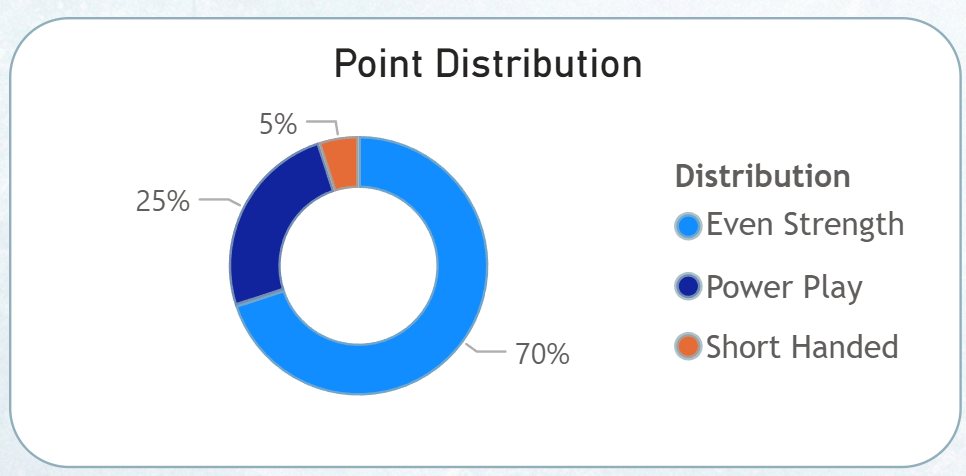
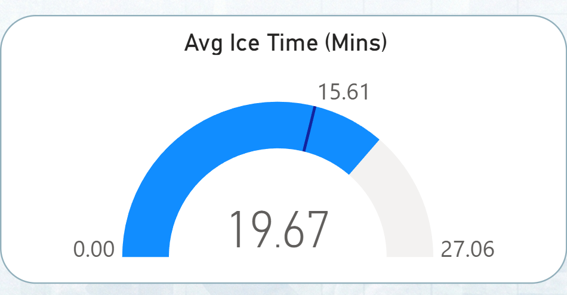

# Dashboard Visualization Breakdown

This project moves away from standard grid tables to create a dynamic **"Player Card"** interface. The goal was to build a tool that scouts or managers could use to get an instant snapshot of a specific player's performance and role.

## 1. The "Player Card" Layout
**Goal:** Create a clean, app-like interface that focuses on one player at a time.


* **Design Choice:** Used a background image with a player silhouette to define the theme.
* **Interactivity:** A single **Player Slicer** (top right) filters the entire page. When a user selects "Aaron Ekblad," every metric updates to reflect only his data.
* **Metric Grouping:**
    * **Top Row (Volume):** Assists, Goals, Games Played, Plus/Minus, Total Points.
    * **Middle Row (Efficiency):** Avg Ice Time, Shooting %, Penalties, Points Per Game (PPG).

## 2. Role Analysis: Point Distribution
**Goal:** Visualize *how* the player scores (e.g., are they a 5-on-5 driver or a Power Play specialist?) without using cluttered text cards.



* **Visualization:** Donut Chart.
* **Data Transformation:** Unpivoted specific columns (Even Strength, Power Play, Shorthanded) to create a single "Distribution" view.
* **Design:** Removed the legend and used direct labeling to save space and reduce cognitive load.

## 3. Context Layer: The "Ice Time" Gauge
**Goal:** Contextualize a player's workload. Seeing "22 minutes" is meaningless unless you know the league average.



* **The Challenge:** Raw data was in seconds (e.g., "1370"), which is unreadable to end-users.
* **The Fix:** Created a DAX measure to convert seconds to minutes:
    ```dax
    Avg Mins = SUM('Query1'[TOI/GP]) / 60
    ```
* **The Comparison Logic:** Added a **League Average** reference line to benchmark the player.
    ```dax
    League Avg Ice Time = 
    VAR AvgSeconds = CALCULATE(AVERAGE('Query1'[TOI/GP]), ALL('Query1'))
    RETURN AvgSeconds / 60
    ```
* **Visual Insight:** * **The Blue Bar:** Represents the selected player's actual minutes.
    * **The Line:** Represents the League Average (~15 mins).
    * **Result:** Instantly identifies if the player is a "Workhorse" (above the line) or a "Depth Player" (below the line).

---
*Tools Used: Power BI Desktop, DAX, Power Query M*