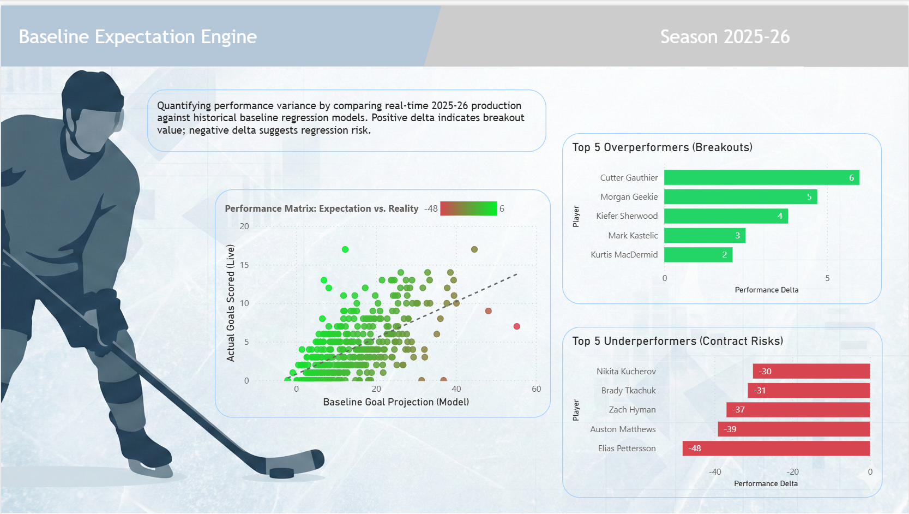

# Baseline Expectation Engine: NHL Performance Variance
### *End-to-End Analytics: Python Machine Learning & Power BI Integration*



## Project Overview
NHL General Managers often fall into the trap of **"Recency Bias"**—overpaying players based on a single lucky season, or trading away players who are statistically due for a bounce-back.

This project solves that problem by building a **Baseline Expectation Engine**. It uses historical data to predict what a player *should* score based on underlying play-driving metrics, and compares it live against what they *are* scoring.

**The Goal:** Identify contract inefficiencies (Breakout Stars vs. Regression Risks) in real-time.

---

## Repository Structure
This project combines a Python Backend with a Power BI Frontend.

```text
NHL_Baseline_Engine/
├── Python/
│   ├── NHL_Goal_Prediction_Model.ipynb  # The ML Pipeline (Cleaning, Training, Testing)
│   ├── NHL_Goal_Prediction_Model.md     # Technical Documentation for the Notebook
│   ├── combined_player_data.csv         # Historical Training Data
│   ├── goals_prediction_model.pkl       # Serialized Model
│   └── goals_scaler.pkl                 # Serialized Scaler
│
├── Data/
│   └── goals_predictions_2023.csv       # The Predictive Output (Fed into Power BI)
│
└── Dashboard/
    ├── NHL_Performance_Delta.pbix       # The Power BI Report File
    ├── TECHNICAL_GUIDE.md               # Step-by-step Implementation Guide
    └── dashboard_variance.png           # Screenshot